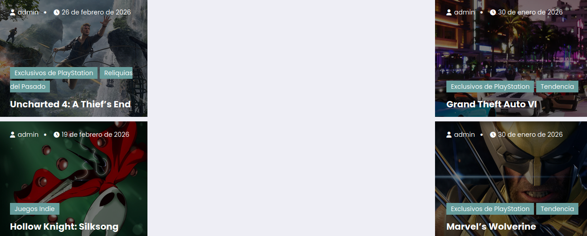

# Practica-Tema-3-instalacion-y-configuracion-de-WordPress

## Descripción del Proyecto

*Este proyecto consiste en una página web de WordPress dedicada a la creación de un portal sobre videojuegos, donde se analizan, reseñan y dan noticias sobre una amplia gama de juegos, desde los más clásicos hasta los más actuales, abarcando todas las plataformas, como PlayStation, PC, móvil, entre otras. El objetivo es ofrecer información detallada y actualizada sobre los videojuegos, así como proporcionar a la comunidad de jugadores un lugar donde puedan encontrar las últimas novedades, reseñas, tutoriales, trucos y mucho más.*

*La página está desarrollada en WordPress con un tema específico para videojuegos, lo que facilita la creación y mantenimiento del contenido relacionado con los juegos, y proporciona una experiencia visualmente atractiva para los usuarios.*

---

## Instalación y configuración

*A continuación, enviaré algunos de los plug-ins que utilice y como funcionan para que se sepa como me ayudo:*

### 1. Contact Form 7: 
*Es un plugin para crear formularios de contacto en WordPress. Permite añadir formularios simples en tu web, como los de contacto, con opciones de personalización y protección contra el spam.*

### 2. Elementor:
*Es un constructor de páginas visual en WordPress. Te permite diseñar páginas arrastrando y soltando elementos sin necesidad de programar, ideal para crear sitios web atractivos fácilmente.*

### 3. GTranslate
*Este plugin traduce automáticamente tu web a varios idiomas usando Google Translate. Perfecto para hacer tu sitio multilingüe sin tener que traducir manualmente cada página.*

### 4. WP Open Street Map
*Permite agregar mapas interactivos de OpenStreetMap en tu sitio. Es una alternativa a Google Maps, fácil de usar y sin límites de uso.*

---

## Capturas de pantalla del portal

## Categorías principales ##

- **Uncharted 4: A Thief's End (Exclusivos de PlayStation)/(Reliquias del Pasado)**
- **Hollow Knight: Silksong (Juegos Indie)**
- **Venba: (Juegos Indie)**
- **Marvel's Wolverine: (Exclusivos de PlayStation)/(Tendencia)**
- **Grand Theft Auto: VI (Exclusivos de PlayStation)/Tendencia)**

---

## Cada entrada incluye: ##
- *Título de la noticia.*
- *contenido/texto de la noticia.*
- *varias imagenes al largo de la noticia.*
- *etiqueta correspondiente.*
- *fecha de publicación.*

